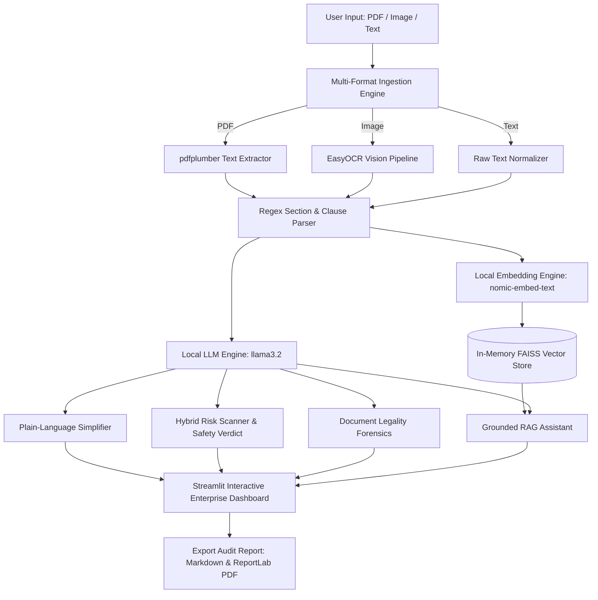

# DocuSense AI — Simple & Honest Policy Companion

**Hack & Fest AI Innovation Hackathon — SRM Institute of Science and Technology**
*Organized by Ansnicore Solutions (Day 4)*
**Team 2 — Track 1: Document Intelligence Systems (Problem Statement 1.2)**

---

## 👥 Team 2 Roster & Identification

| Name                              | Registration Number | Primary Role & Contributions                                                      |
| :-------------------------------- | :------------------ | :-------------------------------------------------------------------------------- |
| **KADIRISANI SAINATH GOUD** | `RA2411053010033` | Team Lead, Full-Stack Architecture, RAG Pipeline & Streamlit UI                   |
| **KAVIN M**                 | `RA2411004010025` | AI/LLM Integration, Ollama Local Model Pipeline & Prompt Grounding                |
| **ANTO CHINNADURAI N A**    | `RA2411004010029` | Document Parser Specialist, Regex Clause Extraction & EasyOCR Integration         |
| **DEEBA KUMAR M**           | `RA2411004010039` | Risk Evaluation Logic, Indic Multi-Language Localization (Tamil/Telugu/Malayalam) |
| **KANISHA R**               | `RA2411004010020` | QA Lead, ReportLab PDF Export Formatting & Demo Dataset Curation                  |

---

## 📌 Project Overview

**DocuSense AI** is a 100% local, privacy-first legal document intelligence platform that translates complex legal agreements, Land Sale Deeds, Lease Policies, Terms of Service (ToS), and Contracts into plain language.

It calculates an explainable **Policy Safety Score (0–100%)**, issues a **Safety Verdict** (`SAFE TO SIGN`, `PROCEED WITH CAUTION`, or `UNSAFE TO SIGN AS-IS`), and performs **Document Legality Forensics** to detect fraudulent or suspicious document text.

> ⚠️ **100% Offline Hard Constraint Compliance**: Operates completely locally using Ollama (`llama3.2:latest` + `nomic-embed-text:latest`). Zero external API calls, zero cloud dependencies, zero data leakage.

---

## ✨ Core Features Matrix

| Feature                                         | Description                                                                                                           | Technical Implementation                                             |
| :---------------------------------------------- | :-------------------------------------------------------------------------------------------------------------------- | :------------------------------------------------------------------- |
| 📤**Multi-Modal Document Ingestion**      | Supports PDF files, Image documents (PNG/JPG/JPEG), and direct Raw Text pasting                                       | `pdfplumber`, `pypdf`, `EasyOCR` (Pure Python OCR), `Pillow` |
| 🌐**Indic Multi-Language Translation**    | Instant plain-language explanations and Q&A in**English, Telugu, Tamil, Malayalam, Hindi, Spanish, and French** | Prompt localization via`llama3.2:latest`                           |
| 📜**Smart Clause Chunking**               | Section-aware regex chunking for land deeds, survey boundaries, and legal articles                                    | Custom rule-based clause parser (`pdf_utils.py`)                   |
| ⚖️**Legality & Authenticity Forensics** | Automatically classifies documents as`LEGITIMATE` or `SUSPICIOUS / POTENTIALLY FRAUDULENT`                        | Forensic LLM analysis & indicator scanner                            |
| 💬**Full-Context Grounded Q&A**           | Answers user queries strictly based on uploaded text; explicitly rejects external hallucinations                      | Full-clause context feeding & strict system prompt grounding         |
| 📊**Explainable Safety Score (0-100%)**   | Generates an audit score based on critical red flags, unilateral terms, and hidden fees                               | Weighted scoring matrix (`llm_utils.py`)                           |
| 📥**Multi-Format Audit Export**           | One-click downloadable audit reports in`.md` and `.pdf` formats with Indic script support                         | `ReportLab` with Windows `Segoe UI` font integration             |

---

## 🏗️ System Architecture & Data Flow



---

## 🚀 Quickstart & Setup Guide

### 1. Prerequisites

Ensure Python 3.10+ and Ollama are installed on your Windows/Linux machine.

### 2. Pull Local AI Models

Run the following commands in your terminal to download the local Ollama models:

```bash
ollama pull nomic-embed-text
ollama pull llama3.2
```

### 3. Install Python Dependencies

```bash
pip install -r requirements.txt
```

### 4. Launch DocuSense AI

```bash
streamlit run app.py
```

Open your browser at **`http://localhost:8501`**.

---

## 📊 Sample Datasets Included for Live Testing

1. **🌾 Sample Land Sale Agreement (Kinathukadavu Parcel)**: Rich property deed featuring Seller (*Palanisamy*), Buyer (*Muthusamy*), ₹45,00,000 consideration, Survey No. 123/2A, Patta number, and 8 legal clauses. Click **`⚡ Load Sample Land & Lease Policy`** in the sidebar.
2. **⚡ Sample SaaS Terms of Service**: Enterprise digital user agreement featuring auto-renewal, unilateral modifications, and limitation of liability clauses.

---

## 🤖 AI Tools Used During Prototyping

- **Local AI Models**: `llama3.2:latest` (text generation & simplification), `nomic-embed-text:latest` (vector embeddings).
- **Development Assistant**: Antigravity AI Assistant for rapid UI prototyping and Streamlit optimization.
